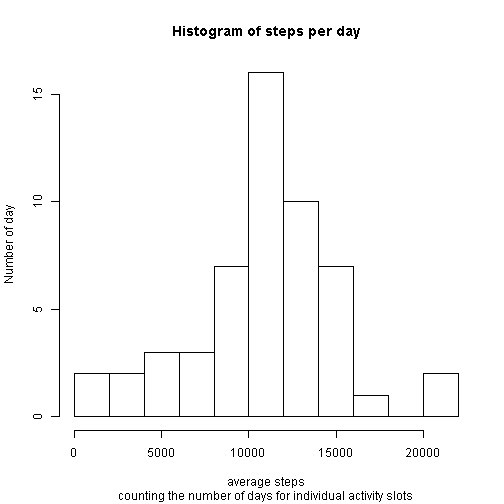
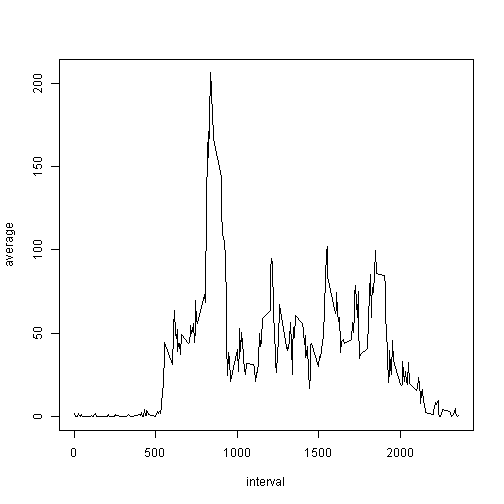
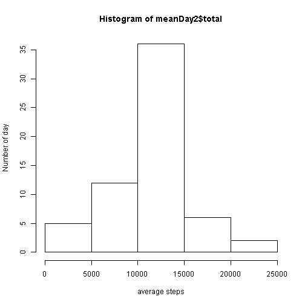
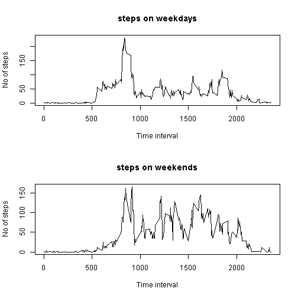

## Introduction
This documents describes analysis ofactivity taken during few month. Activity is measured by steps in a time interval of 5 minutes.  
Activity has 3 varaibles: 
1. steps, measuring the number of steps
2. data, displaying the data of activity in format "%Y-%m-%d"
3. interval, that are 5 minnute intervalls taking throughout the date the last two digits describes the minutes, the first (- or one) digit describes the hour in 24h. So 340 ist the interval starting at 3.40am and 1420 is the intervall starting at 2.20pm.  


## Loading and preprocessing the data
First load plyr library as it is used to summarize.
Then load the data which is expected in the same directory as the Code. 
For international users it is important to set the dec separator. Also the data is readed as is to avoid factoring on the date variable. 


```r
library(plyr)

activity <- read.csv("activity.csv",dec=".",as.is=TRUE)
activity[,"date"]<-as.Date(activity[,"date",],"%Y-%m-%d")
```


## What is mean total number of steps taken per day?
First calculate the number total of steps per day, regardless of the intervall. The figure shows the histogram on the amount of days at which a certain range of steps (2500 bandwidth) was taken. It is evident that there is a peak between 10,000 and 12,500 per day.   


```r
meanDay <- ddply(activity[complete.cases(activity),],'date',function(x) c(total = sum(x$steps)))
hist(meanDay$total,xlab="average steps",ylab="Number of day",freq=TRUE,breaks=10, 
     main="Histogram of steps per day",sub="counting the number of days for individual activity slots")
```

 

This is also visible from the mean 


```r
overallMean = mean(meanDay$total)
overallMean
```

```
## [1] 10766
```
and median 

```r
overallMedian <- median(meanDay$total)
overallMedian
```

```
## [1] 10765
```

## What is the average daily activity pattern?
Another interesting topic of analysis is to understand the distribution of steps througout the day using averages about the intervalls. The next figure uses a line function to show the number of steps (y - axis) during a certain intervall (x - axis)


```r
timeSeries <- ddply(activity[complete.cases(activity),],'interval',function(x)c(average = mean(x$steps)))
plot(timeSeries,type="l")
```

 
The peak is close at 8.35am in the morning. One hypothesiscould be that this is when everybody rushes to work

```r
timeSeries[max(timeSeries$average) == timeSeries$average,]
```

```
##     interval average
## 104      835   206.2
```


## Imputing missing values
There are some missing values which for the step variable. Those are now imputed using the average of the missing time intervall on the other days. 

```r
activityC <- activity
no_of_na <- nrow(activity[complete.cases(activityC) == FALSE,]) ## just needed for verification
activityC$steps <- ifelse(is.na(activityC$steps),timeSeries$average[match(activityC$interval,timeSeries$interval)],activityC$steps)
```
Again a histgram is composed which shows a even higher peak of days from 10,000 - 12,500 steps per day. So imputing the average clearly prefers the peak. 

```r
meanDay2 <- ddply(activityC,'date',function(x) c(mean = mean(x$steps),total = sum(x$steps),freq=TRUE,breaks=10))
hist(meanDay2$total,xlab="average steps",ylab="Number of day")
```

 
The mean and median didn't change as the table below shows. 

```r
overallMean2 = mean(meanDay2$total)
overallMedian2 <- median(meanDay2$total)
c(mean = overallMean2,median = overallMedian2, original_mean = overallMean,original_median =overallMedian )
```

```
##            mean          median   original_mean original_median 
##           10766           10766           10766           10765
```

## Are there differences in activity patterns between weekdays and weekends?
Another interesting fact is the differentiation between weekdays and weekdays. An additional factor variable is used to do this.  
The graphics shows an even higher peak early at 08.35, while during weekends the activity is more balanced throughout the day.  


```r
activityW <- activityC
activityW$weekend <- as.factor(ifelse(weekdays(activityC$date) %in% c("Sonntag","Samstag"),"weekend","weekday"))

timeSeries2 <- ddply(activityW,c('interval','weekend'),function(x)c(average = mean(x$steps)))

par(mfrow=c(2,1))
plot(timeSeries2$interval[timeSeries2$weekend=="weekday"],timeSeries2$average[timeSeries2$weekend=="weekday"],type="l",xlab="Time interval",ylab="No of steps",main="steps on weekdays")
plot(timeSeries2$interval[timeSeries2$weekend=="weekend"],timeSeries2$average[timeSeries2$weekend=="weekend"],type="l",xlab="Time interval",ylab="No of steps",main="steps on weekends")
```

 

